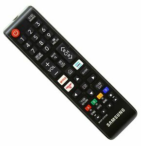

# samsung-ru7179-remote

|master|develop|
|:----:|:-----:|
|||

This is a remote for Samsung RU7179 models. It may work with other models,
but this is untested.

## Further Information

* [Changelog](CHANGELOG)
* [License (GPLv3)](LICENSE)
* [Gitlab](https://gitlab.namibsun.net/namibsun/python/samsung-ru7179-remote)
* [Github](https://github.com/namboy94/samsung-ru7179-remote)
* [Progstats](https://progstats.namibsun.net/projects/samsung-ru7179-remote)
* [PyPi](https://pypi.org/project/samsung-ru7179-remote)
